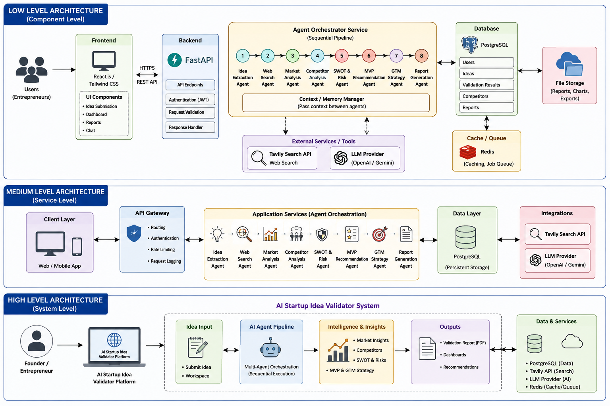

# 🤖 AI Startup Idea Validator

> **A Multi-Agent AI platform that validates startup ideas using Large Language Models (LLMs) and live market intelligence.**

---

## 📖 Project Overview

AI Startup Idea Validator is a Multi-Agent AI platform designed to help entrepreneurs, innovators, and startups evaluate business ideas before investing time and resources into development.

The platform combines Large Language Models (LLMs) with live web search to extract structured business information, identify competitors, and gather market insights.

The project follows a **Multi-Agent AI Architecture**, where each intelligent agent is responsible for a specific task in the startup validation pipeline.

---

# ✨ Features

- 🧠 AI-powered Startup Idea Processing
- 🌐 Live Market Research using Tavily API
- 📊 Structured Business Information Extraction
- 🤖 Multi-Agent AI Architecture
- 🎨 Interactive Streamlit Dashboard
- 📈 Executive Summary Dashboard
- 🔒 Secure API Key Management using `.env`
- 🔌 FastAPI Backend for REST API access (in progress)

---

# 🏗️ Multi-Agent Architecture

## ✅ Implemented Agents

### 🧠 Idea Processing Agent

Responsible for extracting structured information from the user's startup idea.

Extracts:

- Idea Name
- Industry
- Business Model
- Problem Statement
- Proposed Solution
- Target Customers

---

### 🌐 Web Search Agent

Performs live web research using Tavily Search API.

Functions:

- Searches competitors
- Finds market trends
- Retrieves business articles
- Collects market intelligence

---

## 🚧 Planned Agents

- 📊 Market Analysis Agent
- 🏢 Competitor Analysis Agent
- ⚖️ SWOT Analysis Agent
- 💡 MVP Recommendation Agent
- 📢 Go-To-Market Strategy Agent
- 💰 Financial Analysis Agent
- 📄 Report Generation Agent

---

# 🛠️ Tech Stack

| Technology | Purpose |
|------------|---------|
| Python | Backend Development |
| Streamlit | User Interface |
| FastAPI | REST API Backend (in progress) |
| Groq API | LLM-based Idea Processing |
| Tavily API | Live Web Search |
| Git & GitHub | Version Control |

---

# 🔌 Backend API (FastAPI)

As part of migrating toward the full multi-agent system architecture, a FastAPI backend has been added to expose the existing agents as REST endpoints. This runs alongside the current Streamlit app.

## Endpoints

| Method | Endpoint | Description |
|--------|----------|--------------|
| GET | `/health` | Health check |
| POST | `/submit-idea` | Runs the idea through the Idea Processing Agent and Web Search Agent, returns structured extraction + market/competitor search results |

## Running the API

```bash
pip install fastapi uvicorn

uvicorn backend.main:app --reload
```

Then visit `http://127.0.0.1:8000/docs` for the interactive API documentation, where you can test the `/submit-idea` endpoint directly.

> **Note:** This is Phase 1 of migrating to a full production architecture (FastAPI + React + PostgreSQL + Redis). The Streamlit app (`app.py`) remains fully functional as the primary interface during this transition.

---

# 🧪 Backend API Demo

## API Documentation (Swagger UI)


## Health Check


## Submit Idea — Request


## Submit Idea — Response


---

# 📂 Project Structure

```text
AI-Startup-Idea-Validator/
│
├── app.py
├── extraction_agent.py
├── search_agent.py
├── requirements.txt
├── README.md
├── .gitignore
├── backend/
│   └── main.py
├── screenshots/
│   ├── Home.png
│   ├── dashboard.png
│   ├── search-results.png
│   ├── System_Architecture.png
│   ├── fastapi-docs.png
│   ├── health-check.png
│   ├── submit-idea-input.png
│   └── submit-idea-output.png
```

> **Note:** API keys are stored locally in a `.env` file, which is excluded from GitHub using `.gitignore`.

---

# ⚙️ Installation

## 1️⃣ Clone the Repository

```bash
git clone https://github.com/Siddhi9898/AI-Startup-Idea-Validator.git

cd AI-Startup-Idea-Validator
```

---

## 2️⃣ Create a Virtual Environment

```bash
python -m venv venv
```

---

## 3️⃣ Activate the Virtual Environment

### Windows

```bash
venv\Scripts\activate
```

### Linux / macOS

```bash
source venv/bin/activate
```

---

## 4️⃣ Install Dependencies

```bash
pip install -r requirements.txt
```

---

## 5️⃣ Configure Environment Variables

Create a file named `.env`

```env
GROQ_API_KEY=your_groq_api_key
TAVILY_API_KEY=your_tavily_api_key
```

---

## 6️⃣ Run the Application

```bash
streamlit run app.py
```

---

# 💡 Sample Startup Idea

> **An AI-powered platform that matches freelance nurses with hospitals facing temporary staffing shortages. The platform intelligently recommends qualified healthcare professionals based on skills, certifications, experience, location, and availability while managing scheduling, contracts, payments, and performance tracking.**

---

# 🏗️ System Architecture



---

# 📸 Application Screenshots

## 🏠 Home Page


---

## 📊 Structured Idea Dashboard


---

## 🌐 Live Market & Competitor Search


---

# 🚀 Future Enhancements

- Startup Viability Score
- AI-generated SWOT Analysis
- Competitor Comparison Dashboard
- Market Size Estimation
- Funding Opportunity Analysis
- Investor Readiness Report
- PDF Report Generation
- Downloadable Business Report

---

# 👥 Team

**Project:** AI Startup Idea Validator

**Developed as part of the Infosys Springboard Virtual Internship**

- Siddhi Bhingare
- Sravya Maheswari
- Niharika Pamugari
- Kasula Pavan Kumar Reddy
- Shivam Yadav

---

# 📌 Current Project Status

### Milestone 1 ✅

Implemented:

- ✔️ Idea Processing Agent
- ✔️ Web Search Agent
- ✔️ FastAPI backend wrapping Idea Processing + Web Search agents

In Progress:

- ⏳ Market Analysis Agent
- ⏳ Competitor Analysis Agent
- ⏳ SWOT Analysis Agent
- ⏳ MVP Recommendation Agent
- ⏳ Go-To-Market Strategy Agent
- ⏳ Financial Analysis Agent
- ⏳ Report Generation Agent
---

# 📜 License

This project is developed for educational, research, and demonstration purposes as part of the **Infosys Springboard Virtual Internship**.

---

⭐ **If you found this project useful, consider giving it a star on GitHub!**
