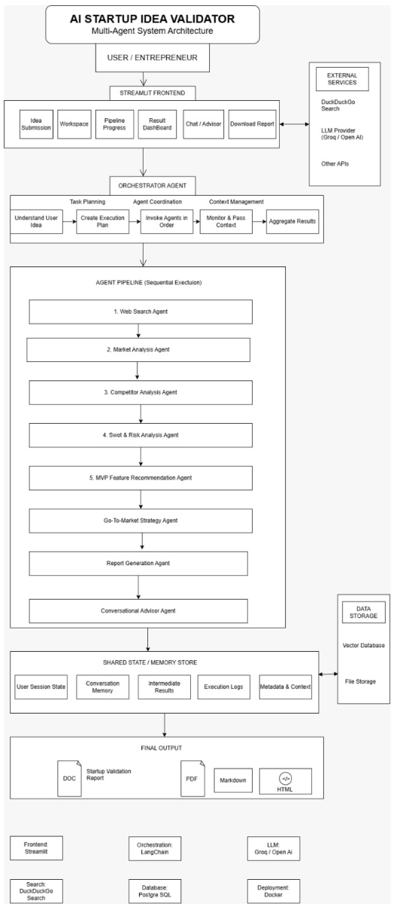
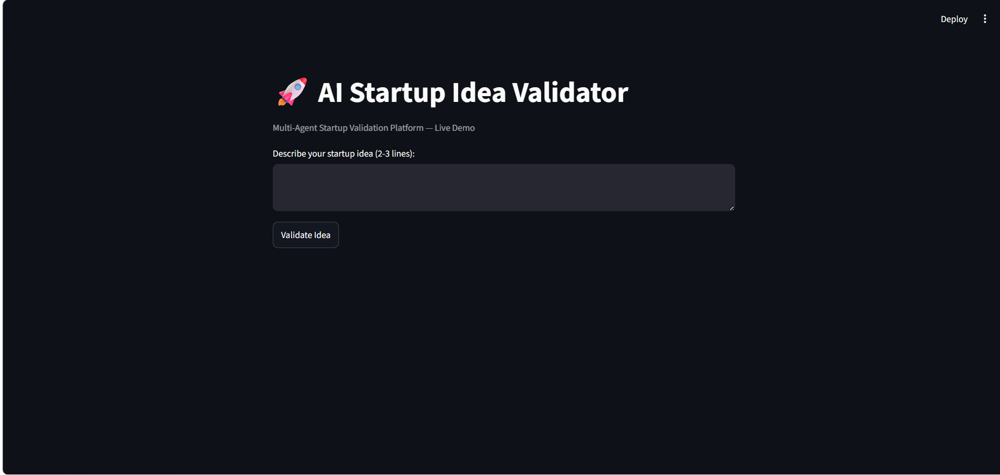
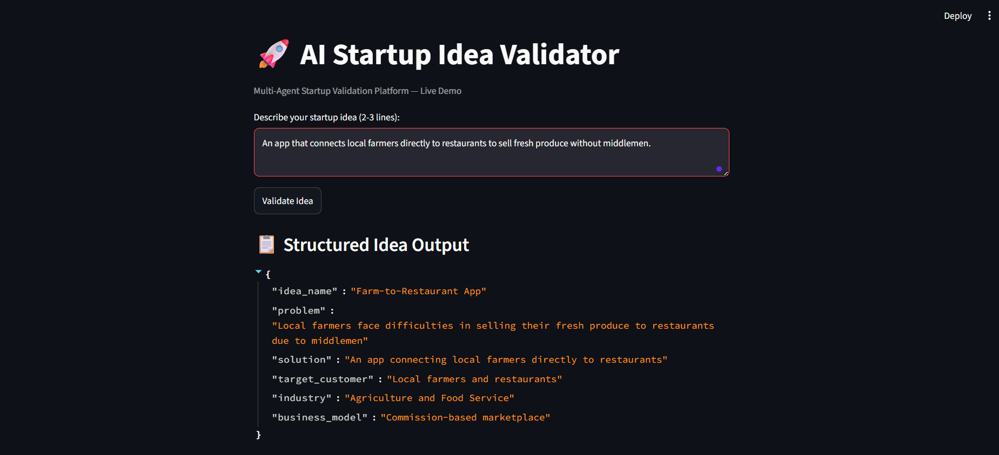
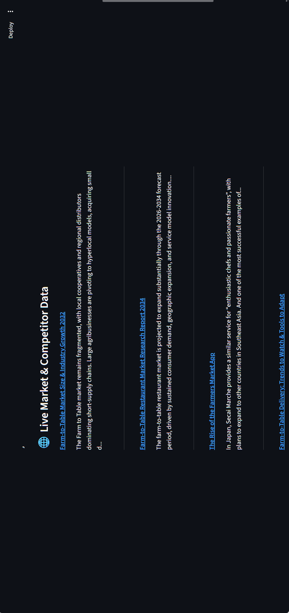
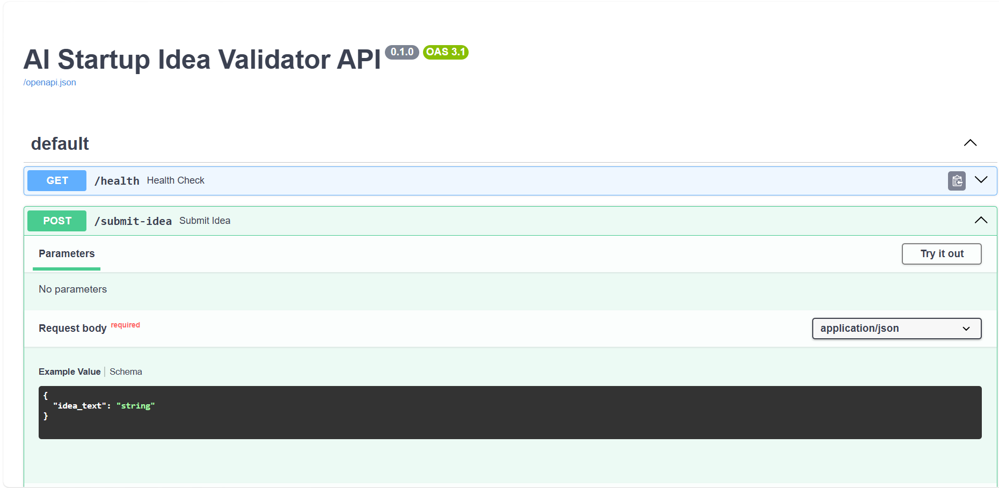
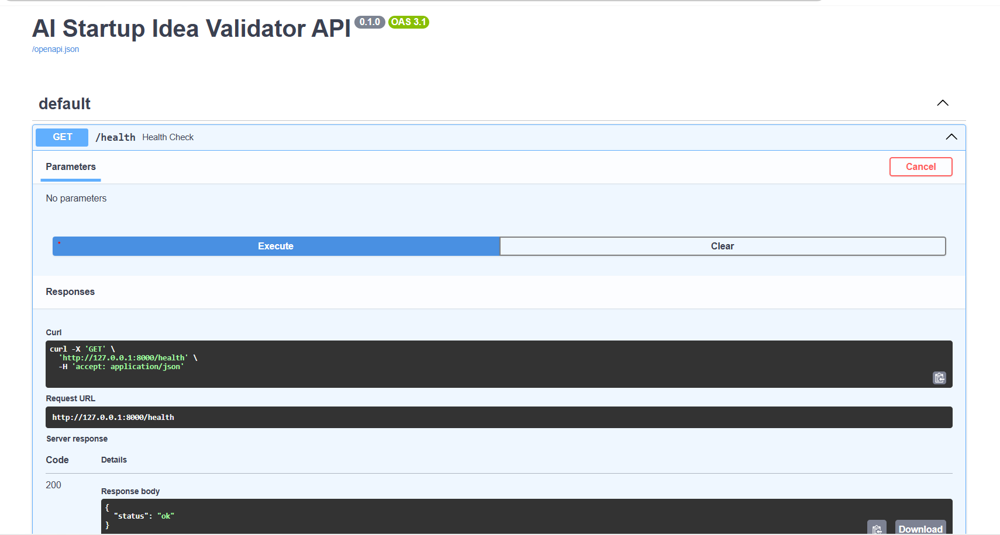
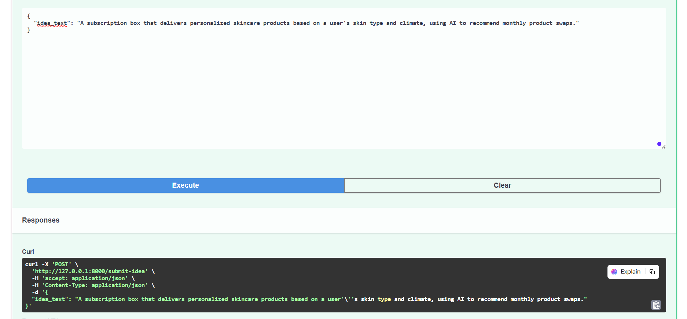
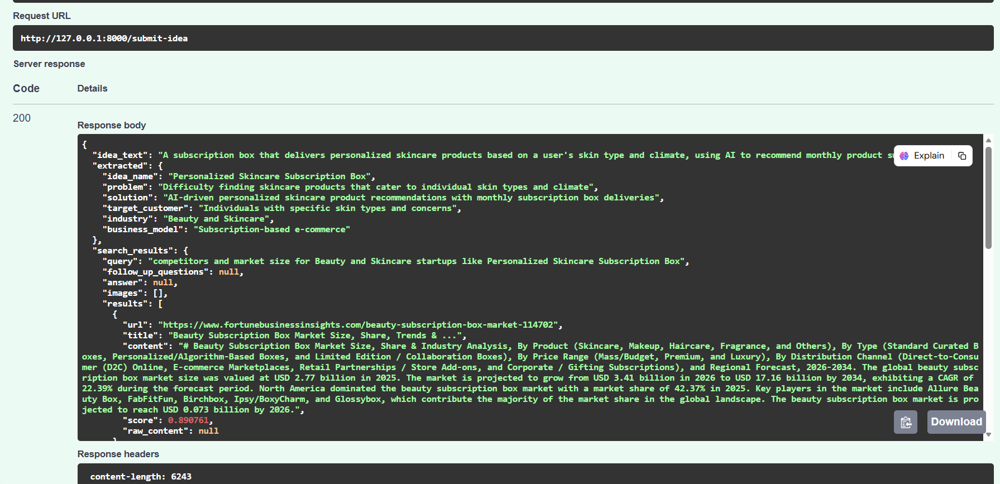

# AI Startup Idea Validator

A Multi-Agent AI platform that validates startup ideas using Large Language Models (LLMs) and live market intelligence.

---

## Project Overview

AI Startup Idea Validator is a Multi-Agent AI platform designed to help entrepreneurs, innovators, and startups evaluate business ideas before investing time and resources into development.

The platform combines Large Language Models (LLMs) with live web search to extract structured business information, identify competitors, gather market insights, and generate mentor-style guidance for the founder.

The project follows a Multi-Agent AI Architecture, where each intelligent agent is responsible for a specific task in the startup validation pipeline, coordinated by a central Orchestrator Agent.

---

## Features

- AI-powered Startup Idea Processing
- Live Market Research using Tavily API
- Structured Business Information Extraction
- Multi-Agent AI Architecture with a central Orchestrator Agent
- Viability Score (0-100) combining idea clarity and market competition signals
- Blind Spot Finder — surfaces what the founder has not addressed
- Honest Summary — a grounded, mentor-style closing assessment
- Elevator Pitch Generator — auto-generated one-liner and tagline
- Funding Suggestions — realistic funding paths with reasoning
- Interactive Streamlit Dashboard
- FastAPI Backend exposing the pipeline as a REST API
- Secure API Key Management using `.env`

---

## How It Works

The system follows this flow, matching the architecture diagram:

1. **User** submits a startup idea through the Streamlit UI or the FastAPI `/submit-idea` endpoint.
2. **Backend (FastAPI)** receives the request and passes it to the Orchestrator Agent.
3. **Orchestrator Agent** manages a Shared State object and runs the agent pipeline in sequence:
   - Idea Extraction Agent — extracts idea name, industry, business model, problem, solution, and target customer
   - Web Search Agent — searches for competitors, market trends, and related articles using Tavily
   - Viability Score module — scores the idea using idea clarity and competition density
   - Insight Agent — generates the Blind Spot Finder, Honest Summary, Elevator Pitch, and Funding Suggestions
4. **Shared State** accumulates each agent's output so later agents and the final report can use earlier results.
5. **Final Output** is aggregated and returned to the user — displayed in the Streamlit dashboard or returned as JSON from the API.

Planned agents (not yet built) — Market Analysis, Competitor Analysis, SWOT and Risk Analysis, MVP Recommendation, Go-To-Market Strategy, Report Generation, and a Conversational Advisor Agent — will plug into this same Orchestrator and Shared State pattern.

---

## Implemented Agents

### Idea Extraction Agent

Extracts structured information from the user's startup idea:

- Idea Name
- Industry
- Business Model
- Problem Statement
- Proposed Solution
- Target Customers

### Web Search Agent

Performs live web research using the Tavily Search API:

- Searches competitors
- Finds market trends
- Retrieves business articles
- Collects market intelligence

### Viability Score

Combines idea clarity and competition density into a single 0-100 score with a plain-language verdict, and is designed to incorporate Market Analysis and SWOT signals once those agents are built.

### Insight Agent

Generates the mentor-style layer of the report:

- Blind Spot Finder — identifies what the founder has not addressed
- Honest Summary — a short, realistic closing statement
- Elevator Pitch Generator — a punchy one-liner and tagline
- Funding Suggestions — realistic funding paths with reasoning

---

## Planned Agents

- Market Analysis Agent
- Competitor Analysis Agent
- SWOT and Risk Analysis Agent
- MVP Feature Recommendation Agent
- Go-To-Market Strategy Agent
- Report Generation Agent
- Conversational Advisor Agent

---

## Tech Stack

| Technology | Purpose |
|------------|---------|
| Python | Core development |
| Streamlit | User interface |
| FastAPI | REST API backend |
| Groq API | LLM-based idea processing and insight generation |
| Tavily API | Live web search |
| PostgreSQL (planned) | Persistent storage and vector search |
| Docker (planned) | Deployment |
| Git and GitHub | Version control |

---

## Project Structure

```text
AI-Startup-Idea-Validator/
|
├── app.py
├── extraction_agent.py
├── search_agent.py
├── viability_score.py
├── insight_agent.py
├── orchestrator_agent.py
├── requirements.txt
├── README.md
├── .gitignore
├── backend/
│   └── main.py
├── screenshots/
│   ├── Home.png
│   ├── dashboard.png
│   ├── search-results.png
│   ├── Architecture.png
│   ├── fastapi-docs.png
│   ├── health-check.png
│   ├── submit-idea-input.png
│   └── submit-idea-output.png
```

Note: API keys are stored locally in a `.env` file, which is excluded from GitHub using `.gitignore`.

---

## Installation

### 1. Clone the Repository

```bash
git clone https://github.com/Siddhi9898/AI-Startup-Idea-Validator.git
cd AI-Startup-Idea-Validator
```

### 2. Create a Virtual Environment

```bash
python -m venv venv
```

### 3. Activate the Virtual Environment

Windows:

```bash
venv\Scripts\activate
```

Linux / macOS:

```bash
source venv/bin/activate
```

### 4. Install Dependencies

```bash
pip install -r requirements.txt
```

### 5. Configure Environment Variables

Create a file named `.env`:

```env
GROQ_API_KEY=your_groq_api_key
TAVILY_API_KEY=your_tavily_api_key
```

### 6. Run the Streamlit Application

```bash
streamlit run app.py
```

### 7. Run the FastAPI Backend (optional, separate terminal)

```bash
pip install fastapi uvicorn
uvicorn backend.main:app --reload
```

Visit `http://127.0.0.1:8000/docs` to test the `/submit-idea` endpoint directly.

---

## Sample Startup Idea

An AI-powered platform that matches freelance nurses with hospitals facing temporary staffing shortages. The platform intelligently recommends qualified healthcare professionals based on skills, certifications, experience, location, and availability while managing scheduling, contracts, payments, and performance tracking.

---

## System Architecture



---

## Application Screenshots

### Home Page



### Structured Idea Dashboard



### Live Market and Competitor Search



---

## Backend API (FastAPI)

A FastAPI backend exposes the same agent pipeline as a REST API, routed through the Orchestrator Agent.

### Endpoints

| Method | Endpoint | Description |
|--------|----------|-------------|
| GET | `/health` | Health check |
| POST | `/submit-idea` | Runs the full agent pipeline and returns extraction, search results, viability score, and insight data |

### Backend API Demo

#### API Documentation (Swagger UI)



#### Health Check



#### Submit Idea — Request



#### Submit Idea — Response



---

## Future Enhancements

- Market Analysis, Competitor Analysis, SWOT, MVP, GTM, and Report Generation agents
- Conversational Advisor Agent (chat-based follow-up)
- PostgreSQL for persistent storage of ideas, results, and reports
- Vector database for semantic search across past validations
- Downloadable PDF and Markdown reports
- Docker-based deployment

---

## Team

Project: AI Startup Idea Validator

Developed as part of the Infosys Springboard Virtual Internship.

- Siddhi Bhingare
- Sravya Maheswari
- Niharika Pamugari
- Kasula Pavan Kumar Reddy

---

## Current Project Status

### Milestone 1

Implemented:

- Idea Extraction Agent
- Web Search Agent
- Viability Score module
- Insight Agent (Blind Spot Finder, Honest Summary, Elevator Pitch Generator, Funding Suggestions)
- Orchestrator Agent with Shared State management
- FastAPI backend wrapping the full pipeline

In Progress:

- Market Analysis Agent
- Competitor Analysis Agent
- SWOT and Risk Analysis Agent
- MVP Feature Recommendation Agent
- Go-To-Market Strategy Agent
- Report Generation Agent
- Conversational Advisor Agent
- PostgreSQL integration

---

## License

This project is developed for educational, research, and demonstration purposes as part of the Infosys Springboard Virtual Internship.
